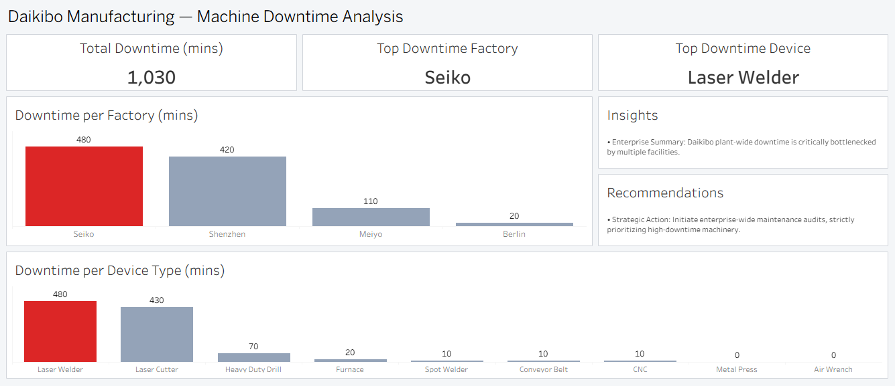
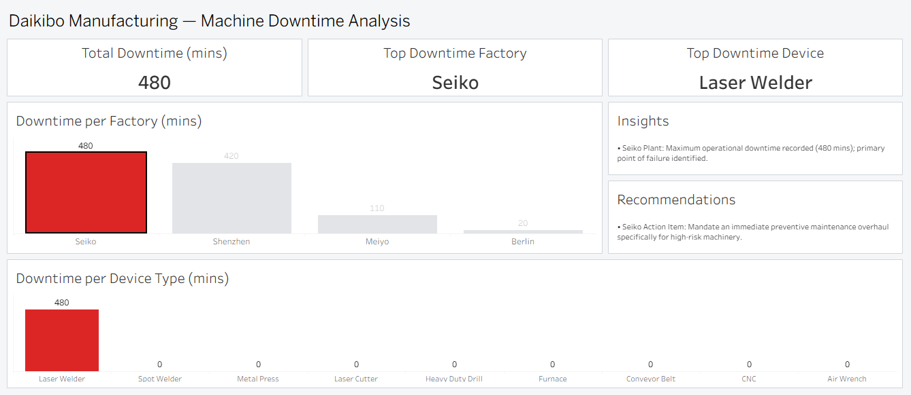
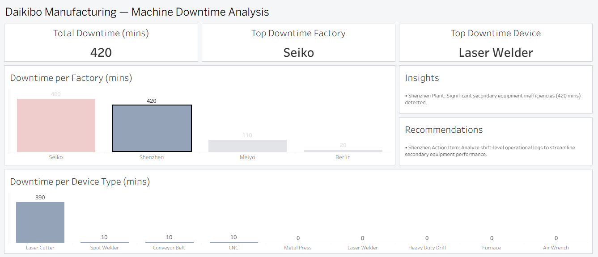
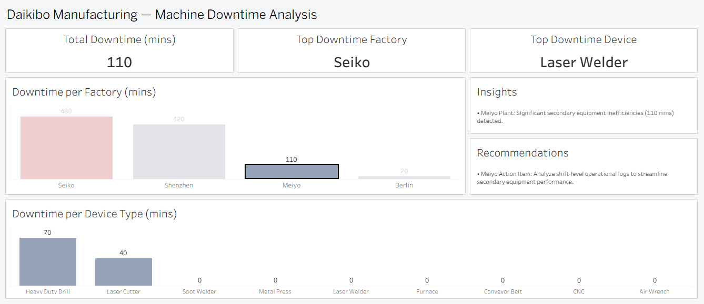
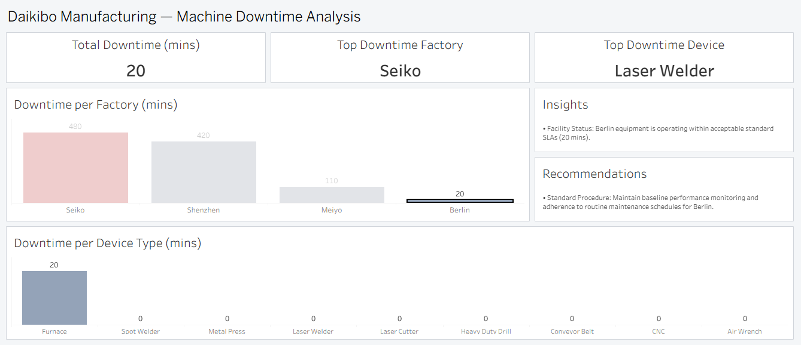

# Daikibo Manufacturing — IIoT Downtime Diagnostic Dashboard

> **An executive-level Tableau dashboard identifying root causes of assembly-line downtime across a global IIoT-instrumented manufacturing network.**

---

## 🏢 The Business Problem

Modern manufacturing depends on continuous throughput. Every minute of unplanned downtime translates directly into lost production units, idle labor costs, and missed client delivery commitments. 

Daikibo's operations team deployed **Industrial IoT (IIoT) sensors** across all machinery, emitting health status messages every 10 minutes. However, the telemetry data sat in raw JSON format without an analytical layer. The leadership lacked visibility into two critical areas:
1. **Where** is the operational time bleeding across the four global facilities?
2. **Why** is it happening? Which specific machine types are the primary failure drivers?

Without these answers, maintenance budgets were deployed reactively. This project transforms that raw telemetry into a defensible, drill-through diagnostic tool to enable targeted, preventive maintenance.

---

## 💡 The Solution

A single-page executive diagnostic dashboard that answers business questions instantly and maintains analytical context at every level of drill-down.

**Key Design Principles Executed:**
* **Executive-First Layout:** Top-level KPI cards for immediate network health, supported by comparison charts and a live narrative panel.
* **Diagnostic Drill-Down:** Interactive filtering allows users to isolate specific facilities and instantly view their machine-type failure contributions.
* **Dynamic Narratives:** The Insights and Recommendations panels are programmatically driven by user selection, ensuring the analytical takeaway is always aligned with the visual state.
* **Stable KPI Reporting:** The "Top Downtime Factory" KPI uses nested Level-of-Detail (LOD) expressions to always reflect the *global* leader, preventing misleading labels during drill-downs.

---

## 📊 Dashboard Preview & Interactive States

### Primary Executive View (All Facilities Baseline)


---

### Diagnostic Drill-Down Proofs (Interactive Filter States)

Below is the visual proof of how the dashboard KPIs, charts, and dynamic narrative texts update in real-time under user selection:

| Facility State | Downtime Impact | Visual Proof |
| :--- | :--- | :--- |
| **Seiko (Osaka)** <br>*Global Bottleneck* | 480 Mins <br>(LaserWelder driven) |  |
| **Shenzhen (China)** <br>*Secondary Contributor* | 420 Mins <br>(LaserCutter driven) |  |
| **Meiyo (Tokyo)** <br>*Minor Inefficiency* | 110 Mins <br>(HeavyDutyDrill) |  |
| **Berlin (Germany)** <br>*Within Standard SLA* | 20 Mins <br>(Isolated incident) |  |

---

## 🔍 Key Insights Uncovered

* **Total Network Downtime:** 1,030 minutes recorded across 4 facilities over the month.
* **Primary Bottleneck (Seiko, Osaka):** Accounts for 480 minutes of downtime (nearly 50% of the network total). The root cause is severely concentrated in a single machine class: **LaserWelder**.
* **Secondary Contributor (Shenzhen, China):** 420 minutes of downtime, driven primarily by **LaserCutter** failures (390 mins).
* **Minor Inefficiencies (Meiyo, Tokyo):** 110 minutes concentrated in HeavyDutyDrill and LaserCutter. Not critical, but requires operational monitoring.
* **Stable Operations (Berlin, Germany):** Operating well within acceptable SLAs with only 20 minutes of isolated downtime.
* **Class-Level Failure Mode:** Together, LaserWelder and LaserCutter account for **~88% of all network downtime**. This indicates a machine-class vulnerability rather than isolated facility mismanagement.

---

## ⚙️ Technical Approach & Skills Demonstrated

### 1. Data Transformation & Measure Creation
Raw IIoT JSON telemetry (~30,000+ status messages) was parsed and processed. Downtime was quantified by converting binary string states into time intervals using calculated fields:
`IF [Status] = "unhealthy" THEN 10 ELSE 0 END`

### 2. Advanced LOD Expressions (Fixing Analytical Bugs)
A naïve "Top Factory" card will dynamically change based on user filters (e.g., falsely labeling the lowest-downtime facility as "Top" if it's the only one selected). This was engineered out using a 3-step nested `FIXED` LOD calculation to lock the global context:
`{ FIXED : MAX(IF { FIXED [Factory] : SUM([Unhealthy]) } = { FIXED : MAX({ FIXED [Factory] : SUM([Unhealthy]) }) } THEN [Factory] END) }`

### 3. Context-Aware Narrative Logic
To prevent false-positive text generation (e.g., calling the 2nd highest downtime the "Maximum"), a dynamic string calculation compares the current selection's aggregate against the global LOD maximum. This seamlessly handles aggregate vs. non-aggregate Tableau rules.

### 4. Presentation-Layer Data Hygiene
Raw database strings (`daikibo-factory-seiko`, `LaserWelder`) were cleaned for executive display using Tableau Aliases and `CASE` statement fields, ensuring zero backend syntax leaked to the end-user.

---

## 🗂️ Repository Structure

```text
daikibo-downtime-analysis/
├── README.md
├── daikibo-downtime-analysis.twbx    # Packaged Tableau workbook (data embedded)
├── data/
│   └── daikibo-telemetry-data.json   # Raw IIoT telemetry source data
└── screenshots/
    ├── 01_dashboard_full.png
    ├── 02_seiko_selected.png
    ├── 03_shenzhen_selected.png
    ├── 04_meiyo_selected.png
    └── 05_berlin_selected.png
```

---

## 🛠️ Tech Stack

* **Business Intelligence:** Tableau Desktop
* **Calculations:** Tableau LODs, Table Calculations, Logical Functions
* **Data Format:** JSON (Unified IIoT Telemetry)

---

## 👤 Author

**Hafiz Zaman Yaseen** 
Data Analyst | Lahore, Pakistan 
🔗 [LinkedIn](https://www.linkedin.com/in/zaman-dataanalyst/) | 🔗 [GitHub](https://github.com/zaman-dataanalyst)