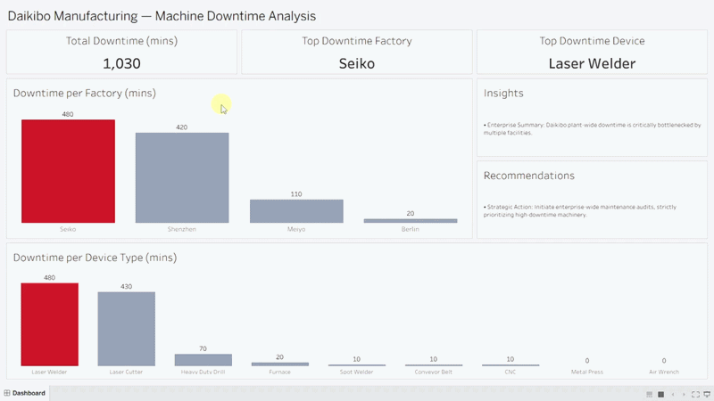

# Daikibo Manufacturing — Machine Downtime Diagnostic Dashboard

> **Executive Tableau dashboard identifying root causes of assembly-line downtime across a global IIoT-instrumented manufacturing network.**

**📊 [View the live interactive dashboard on Tableau Public](https://public.tableau.com/app/profile/hafiz.zaman.yaseen/viz/DaikiboManufacturing-MachineDowntimeAnalysis/Dashboard)**

---

## 🏢 The Business Problem

Modern manufacturing depends on continuous throughput. Every minute of unplanned downtime translates directly into:
- Lost production units
- Idle labor cost on the floor
- Missed client delivery commitments
- Escalating repair and part-replacement expenses

Daikibo already had **Industrial IoT (IIoT) sensors** on all machinery, each sending a `healthy` or `unhealthy` status message every 10 minutes to a central telemetry platform. But the data sat in raw JSON with no analytical layer. Leadership needed exactly **two questions** answered:

> **1. In which location did machines break down the most?**
>
> **2. Within that location, which machines broke most often?**

Without answers, the maintenance budget was being deployed reactively rather than surgically. This dashboard replaces gut-feel with a defensible, drill-through diagnostic tool.

---

## 💡 The Solution

A single-page executive dashboard that answers both questions in under 10 seconds of viewing, and continues answering them at every level of drill-down. Built as part of the **Deloitte Australia Data Analytics Job Simulation** on Forage.

**Key design principles executed:**
- **Executive-first layout** — Top-level KPI cards for immediate network health, supported by comparison charts and a live narrative panel.
- **Diagnostic drill-down** — Clicking any facility filters the machine-type chart to show that facility's specific contribution.
- **Dynamic narratives** — The Insights and Recommendations panels rewrite themselves based on the current selection, ensuring the analytical takeaway is always aligned with the visual state.
- **Deliberately static "Top" KPIs** — The `Top Downtime Factory` and `Top Downtime Device` cards do not change with selection. The client's two questions each have **one correct answer**, independent of what a viewer happens to be exploring. Level-of-Detail (LOD) expressions enforce this stability.

---

## 🔍 Key Insights Uncovered

- **Total network downtime for the month:** 1,030 minutes across 4 facilities.
- **Seiko (Osaka) is the primary bottleneck:** 480 minutes, nearly half the network total. Root cause: **100% of it traced to a single machine class — the Laser Welder.**
- **Shenzhen (China) is a close second:** 420 minutes, driven primarily by Laser Cutter failures (390 mins).
- **Meiyo (Tokyo) shows secondary inefficiency:** 110 minutes concentrated in Heavy Duty Drill (70 mins) and Laser Cutter (40 mins). Not critical, but worth monitoring.
- **Berlin is operating within acceptable SLA:** 20 minutes total, isolated to a single Furnace incident.
- **Class-Level Failure Mode:** Together, Laser Welder and Laser Cutter account for **~88% of all network downtime**. This indicates a machine-class vulnerability rather than isolated facility mismanagement.

### Dashboard States — Diagnostic Drill-Down

Every state below reflects live filtering; the KPIs, chart highlight, and narrative panels all update in response to selection.



| State | Facility Total | View |
| :--- | :--- | :--- |
| **All Facilities** (unfiltered baseline) | 1,030 mins | [View](screenshots/01_dashboard_full.png) |
| **Seiko** — global max, primary bottleneck | 480 mins | [View](screenshots/02_seiko_selected.png) |
| **Shenzhen** — secondary contributor | 420 mins | [View](screenshots/03_shenzhen_selected.png) |
| **Meiyo** — moderate inefficiency | 110 mins | [View](screenshots/04_meiyo_selected.png) |
| **Berlin** — within operational SLA | 20 mins | [View](screenshots/05_berlin_selected.png) |

---

## ⚙️ Technical Approach & Skills Demonstrated

### 1. Data Transformation & Downtime Measure
Source data arrived as a unified JSON file (`daikibo-telemetry-data.json`) covering May 2021. Downtime is measured via a calculated field that converts each `unhealthy` status message (sent every 10 mins) into an integer representing lost time:
```tableau
IF [Status] = "unhealthy" THEN 10 ELSE 0 END
```

### 2. LOD-Locked KPI Cards (Fixing Analytical Bugs)
A naïve implementation of a "Top Factory" card takes whatever facility the user has selected and displays it. Selecting the lowest-downtime facility would mislabel it as "Top". This was fixed using a chained LOD expression to lock the global context:
```tableau
// Step 1 — Per-factory total (fixed at the Factory grain)
{ FIXED [Factory] : SUM([Unhealthy]) }

// Step 2 — Network-wide maximum (fixed at no grain)
{ FIXED : MAX([Factory Total Downtime]) }

// Step 3 — The factory that owns the max
{ FIXED : MAX(IF [Factory Total Downtime] = [Global Max Downtime] THEN [Factory] END) }
```
Both the Top Factory and Top Device cards stably report the single correct answer across every drill-down state.

### 3. Context-Aware Narrative Logic
To prevent false-positive text generation (e.g., calling the 2nd highest downtime the "Maximum"), a dynamic string calculation compares the current selection's aggregate against the global LOD maximum. This seamlessly handles aggregate vs. non-aggregate Tableau rules:
```tableau
IF [Factory Count In View] = MIN([Total Factory Count]) THEN
    "• Enterprise Summary: Daikibo plant-wide downtime is critically bottlenecked..."
ELSEIF SUM([Unhealthy]) = MIN([Global Max Downtime]) THEN
    "• " + [Factory Clean Name] + " Plant: Maximum operational downtime recorded..."
// Additional ELSEIF logic continues for secondary inefficiencies and SLAs
END
```

### 4. Presentation-Layer Data Hygiene
Raw source strings (`daikibo-factory-seiko`, `LaserWelder`) are unfit for executive display. They were cleaned using two mechanisms:
- **Tableau Aliases** on dimensions to handle chart axes and standard tooltips automatically.
- **`CASE` statement fields** to handle narrative and calculated text arrays, ensuring zero backend syntax leaked to the end-user.

---

## 🗂️ Repository Structure

```text
daikibo-downtime-analysis/
├── README.md
├── dashboard/
│   └── daikibo-downtime-analysis.twbx    # Packaged Tableau workbook (data embedded)
├── data/
│   └── daikibo-telemetry-data.json       # Raw IIoT telemetry source data
├── assets/
│   └── demo.gif                          # Dashboard interactive preview
└── screenshots/
    ├── 01_dashboard_full.png
    ├── 02_seiko_selected.png
    ├── 03_shenzhen_selected.png
    ├── 04_meiyo_selected.png
    └── 05_berlin_selected.png
```

---

## 🛠️ Tech Stack

- **Business Intelligence:** Tableau Desktop (LODs, Table Calcs, Filter Actions, Dynamic Logic)
- **Data Format:** JSON (Unified IIoT Telemetry)

---

## 🚀 How to Explore This Dashboard

1. **[View the live interactive dashboard directly on Tableau Public](https://public.tableau.com/app/profile/hafiz.zaman.yaseen/viz/DaikiboManufacturing-MachineDowntimeAnalysis/Dashboard)**. No download required.
2. Download the `daikibo-downtime-analysis.twbx` file from the `dashboard/` folder in this repository.
3. Open it in Tableau Desktop to review the LOD calculations, calculated fields, and dashboard actions natively.

---

## 👤 Author

**Hafiz Zaman Yaseen**  
Data Analyst | Lahore, Pakistan  
🔗 [LinkedIn](https://www.linkedin.com/in/zaman-dataanalyst/) | 🔗 [GitHub](https://github.com/zaman-dataanalyst)